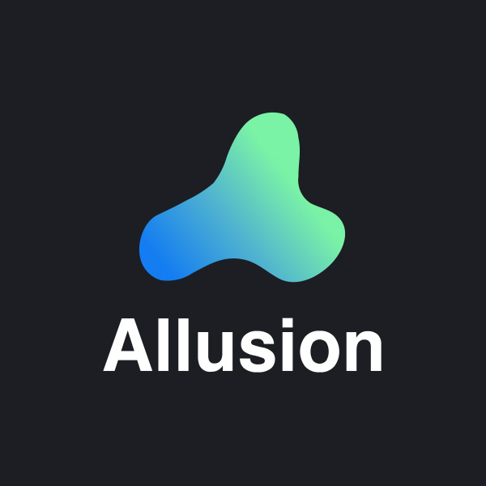

# Allusion

**Allusion** é um gerenciador de biblioteca visual para profissionais criativos. Uma única ferramenta para organizar suas referências, inspirações e imagens favoritas.

Construído com **Rust + Tauri 2** no backend e **React** no frontend, foi pensado para ser leve: iniciar rápido, consumir pouca memória (RAM) e indexar grandes bibliotecas com fluidez.

> Projeto derivado do [Allusion original](https://github.com/allusion-app/Allusion), migrando-o do Electron para o Tauri 2 (Rust). O repositório upstream continua sendo a referência do projeto original. Documentação técnica em [`docs/`](docs/).

## O que você pode fazer

- Organizar imagens, pastas, tags e referências em um só lugar
- Pesquisar e filtrar sua biblioteca visual
- Visualizar e gerenciar coleções com uma interface descomplicada

## Stack

| Camada   | Tecnologia                                   |
| -------- | -------------------------------------------- |
| Backend  | Rust · Tauri 2 (IPC nativo, zero Electron)   |
| Frontend | React 18 · MobX 6 · Dexie 3 (IndexedDB)      |
| Nativos  | Masonry (layout) · EXR · thumbnails · scanner · EXIF |

## Como rodar

Pré-requisitos: [NodeJS](https://nodejs.org) + [Yarn](https://yarnpkg.com) e a [toolchain Rust](https://rustup.rs).

```bash
yarn install     # instala as dependências
yarn tauri:dev   # compila o webpack e abre o shell Tauri
```

Durante o desenvolvimento de UI, rode em dois terminais:

```bash
yarn dev         # watch do webpack → build/
yarn tauri:dev   # shell Tauri (Rust)
```

### Build de release

```bash
yarn production   # webpack de produção
yarn tauri:build  # webpack + instalador Tauri
```

### Testes e lint

```bash
yarn test   # Jest
yarn lint   # ESLint + Prettier
```

## Estrutura

```
src/          Renderer React (componentes, stores, workers)
src/ipc       Camada de comunicação frontend ↔ Rust
src-tauri/    Backend Rust (comandos, serviços, scanner, watcher)
common/       Utilitários TS compartilhados (fs, exif, config, cor…)
widgets/      Widgets de UI reutilizáveis
docs/         Documentação de arquitetura e planos
scripts/      Scripts de desenvolvimento (benchmarks)
```

## Saiba mais

- [Documentação](docs/) — arquitetura Tauri 2, mapa de migração, métricas
- [Projeto no GitHub (Kanban)](https://github.com/users/oguilhermemoraes/projects/2)
- [Projeto original](https://github.com/allusion-app/Allusion)
